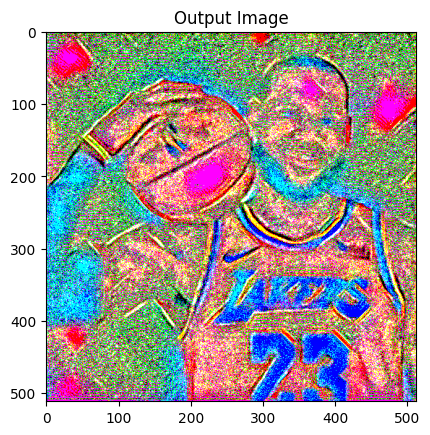

# styletransfer

An implementation of the paper: A Neural Algorithm of Artistic Style

> By: Amol Budhiraja
> @amolbudhiraja

# Paper Information
* **Title**: A Neural Algorithm of Artistic Style
* **Authors**: Leon A. Gatys, Alexander S. Ecker, Matthias Bethge
* **Link**: https://arxiv.org/abs/1508.06576

# Installation
For enhanced speed and processing power, it is highly recommended to run this notebook with GPUs. I highly recommend using online services like Google Collab that enable the usage of GPUs when running this code. 

If you are trying to run the code locally, please refer to the falling steps: 

1. Clone this repository.
2. Create a virtual environment: `python3 -m venv venv`
3. Active the virtual environment: `source venv/bin/activate`
4. Install the dependencies: `pip install -r requirements.txt`
5. Run the code in `main.py`!

# Approach

To transfer the artistic style of one image to another, we want to split this problem into two main parts: 
1. Detect the artistic style of the first image. 
2. Apply the artistic style to the second image. 

## Detecting Artistic Style and Content
To achomplish this task, we can leverage key properties of Convolutional Neural Networks (CNNs) that enable us to grasp an understanding of the artistic style contained in our image. Specifically, with lower levels of our network we can better grasp lower level features about the pixel values directly (i.e, brightness, intensity, etc.) and with higher levels of our network we can understand higher level features like shape, color, and content. Additionally, we will use a feature space that was intended to capture texture information. This will enable us to capture a much more representative space than a standard model architecture. 

# VGG-Network
We can leverage a VGG-Network architecture to extract the style information. The VGGNet (Visual Geometry Group) is a very deep convolutional network that is optimzied for object detection tasks. 

We will use the fature space provided by the 16 convolutional and 5 pooling layers of the VGG-19 model. We will not use any of the fully connected layers. We will also be using mean-pooling instead of max-pooling given its improved performance with outliers and artifacts in the image. 

Specifically, we will reconstruct the input image with the following layers from the original VGG-Network. 
* `conv1_1`
* `conv2_1`
* `conv3_1`
* `conv4_1`
* `conv5_1`

According to the paper we should observe that the lower layers yield an almost perfect construction while in the higher level layers, detailed pixel information is lost while the higher-level content is preserved. 

## Loss Function
Based on the paper, we will use the following loss function: 

$L_{\mathbf{p}, \mathbf{x}, \mathbf{l}} = \frac{1}{2} \sum_{i,j} (F^l_{ij} - P^l_{ij})^2$

where $\vec{p}, \vec{x}$ are the original image and the generated respectively, and $P^{l}, F^{l}$ are their respective feature representations per layer l. 

## Gram Matrix

On top of the CNN, we will build a style representation that computes the correlations
between the different filter responses. Specificallyl, we will compute a Graph Matrix: 

$$G^{l} \in \mathbb{R}^{N_l \times N_l}$$

where $G^{l}_{ij}$ is the inner product between the vectorized feature map i and j in layer l: 

$F^l_{ij} = \sum_k F^l_{ik} F^l_{jk}$

To compute another image that matches the style representation of the original image, we can gradient descent from a white noise image and apply the following loss function that assess the mean-squared distance between the entires of the Gram matrix of the original matrix and the image to be generated: 

$$L_{style}(\vec{a}, \vec{x}) = \sum_{l=0}^{L}w_{l}E_{l}$$

where,

$E_l = \frac{1}{4N^2_lM^2_l} \sum_{i,j} (G^l_{ij} - A^l_{ij})^2$

We can combine these loss functions together and define a squared error loss function between the two feature representations: 

$$L_{total}(\vec{p}, \vec{a}, \vec{x}) = \alpha L_{content}(\vec{p}, \vec{x}) + \beta L_{content}(\vec{a}, \vec{x})$$

where $\alpha, \beta$ are weighing factors for the content and style reconstruction respectively. 

We will explore various $\alpha$ and $\beta$ values and explore how a preference of either style or content affects the results of the model. 

# Results

The final algorithm turned out great! It is able to succesfully transfer the style of the style image to the content image. Interestingly enough, it is able to also do the reverse by inverting the weightage and input-order. 

To measure the impact of the weight and number of optimizer steps on the results of the model, I tried various $\alpha$ and $\beta$ values and step counts. Here are the results from them: 

## Inputs
To test the model, I used two pictures: (1) My favorite basketball player Lebron James and (2) A design pattern I found online. Here are the original images. 

## Changing Style Weight
As expected an increase in style weight corresponded to a greater emphasis of style in the resulting image. A similar trend was noticed with changing content weight - hence it is omitted from this presentation. 

### $\alpha$ = 8000, $\beta = 1$, 200 steps

### $\alpha$ = 100000, $\beta = 1$, 200 steps

### $\alpha$ = 120000, $\beta = 1$, 200 steps

## Changing Number of Optimzer Steps
Interestingly, lesser gradient steps corresponded to a better result. This appears to occur because more gradient steps leads to a greater bias towards the larger weight, which for the sake of the results presented below was style. Hence, some of the core aspects of the content tended to be overshadowed in the results with the larger step count. 

### $\alpha$ = 100000, $\beta = 1$, 50 steps

### $\alpha$ = 100000, $\beta = 1$, 100 steps

### $\alpha$ = 100000, $\beta = 1$, 200 steps

### $\alpha$ = 100000, $\beta = 1$, 400 steps

